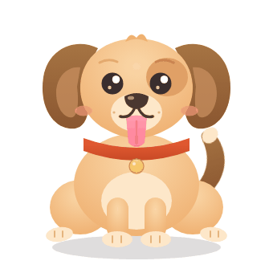

# Devin_dog

かわいい犬のアニメーションSVGアセットです（`dog.gif` はそのGIF変換版）。全身付きで、CSSアニメーション入り（しっぽを振る・瞬き・舌のパンティング・耳がピクッと動く・呼吸）。



## 使い方

HTMLにそのまま埋め込めます:

```html

```

または `<svg>` の中身をそのまま貼り付けてインラインSVGとしても使えます。
アニメーションはSVG内部の `<style>` で定義されているため、`` でも単体ファイルでも再生されます。
